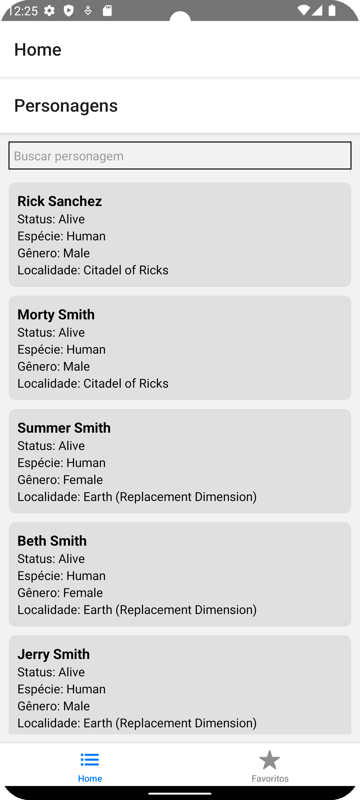
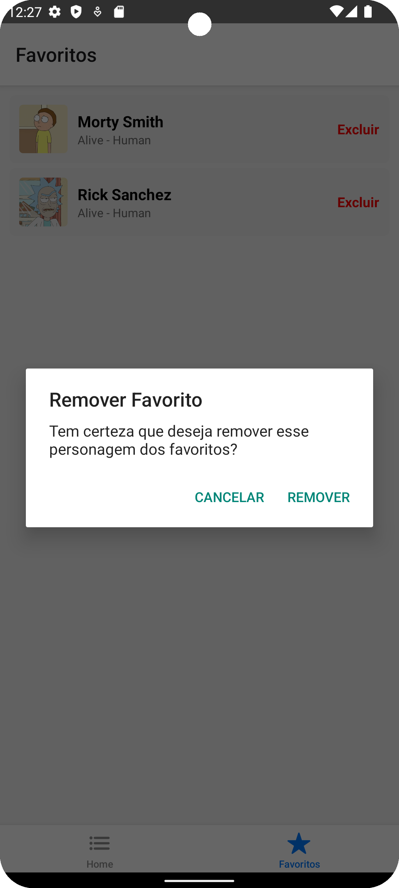

# 📱 RMApp – Rick and Morty App

Aplicativo React Native consumindo dados da [Rick and Morty API](https://rickandmortyapi.com/documentation/).

Feito para o desafio técnico – demonstração de consumo de API REST, navegação, persistência local e listagem de dados.

---

## ✏️ Exercício escolhido

Escolhi o exercício **B: Ricky and Morty (RMApp)** porque:
- Gosto de APIs públicas e de demonstrar consumo real
- Permite mostrar navegação (stack + bottom tabs)
- Permite salvar favoritos localmente (AsyncStorage)
- É um bom equilíbrio entre front-end, lógica de negócio e UX

---

## 🏗 Estrutura de pastas

```plaintext
src/
 ├── api/                   # Serviços de API (axios)
 │   └── characterService.ts
 │   └── episodeService.ts
 ├── components/            # Componentes reaproveitáveis
 │   └── CharacterCard.tsx
 │   └── EpisodeCard.tsx
 ├── navigation/            # Navegação (stacks e tabs)
 │   └── AppNavigator.tsx
 ├── screens/               # Telas
 │   └── CharacterListScreen.tsx
 │   └── CharacterDetailScreen.tsx
 │   └── EpisodeDetailScreen.tsx
 │   └── FavoritesScreen.tsx
 ├── storage/               # AsyncStorage helpers
 │   └── favoritesStorage.ts
 └── App.tsx                # Entry point

---

## 📸 Prints e evidências

| Lista de Personagens | Detalhe do Personagem | Episódio com Personagens |
|---------------------:|---------------------:|------------------------:|
|  |  |  |

| Favoritos | Exclusão de Favorito |
|---------:|---------------------:|
|  |  |

---

## ▶️ Como rodar e testar a aplicação

Pré-requisitos:
- Node >= 18
- Android Studio / Emulador ou dispositivo Android
- Yarn ou NPM

```bash
# Instalar dependências
npm install

# Limpar build anterior (recomendado)
cd android && ./gradlew clean && cd ..

# Iniciar Metro bundler
npm start

# Em outro terminal: compilar e rodar no Android
npx react-native run-android
