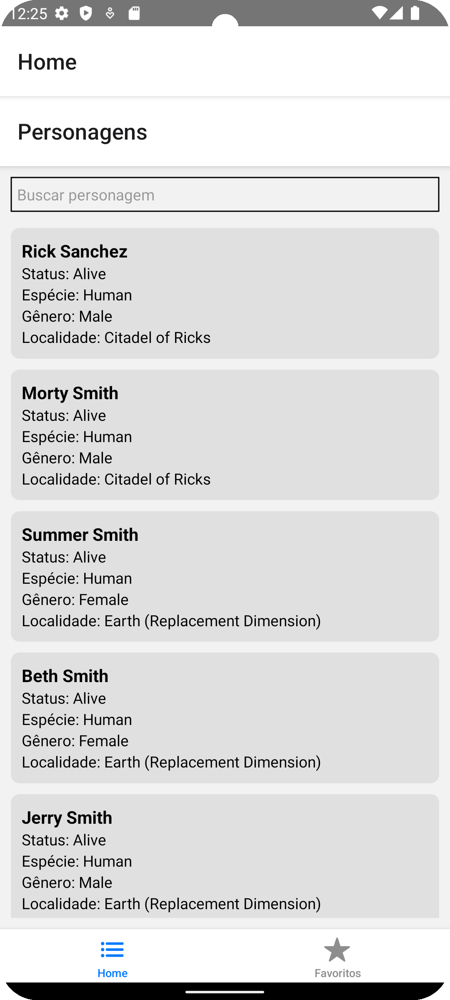
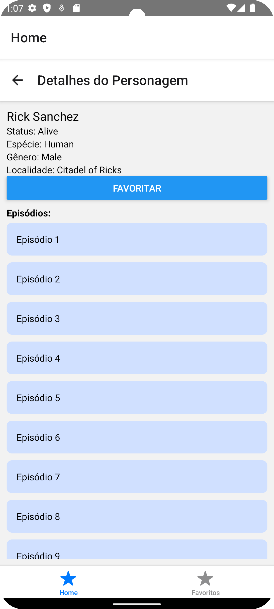
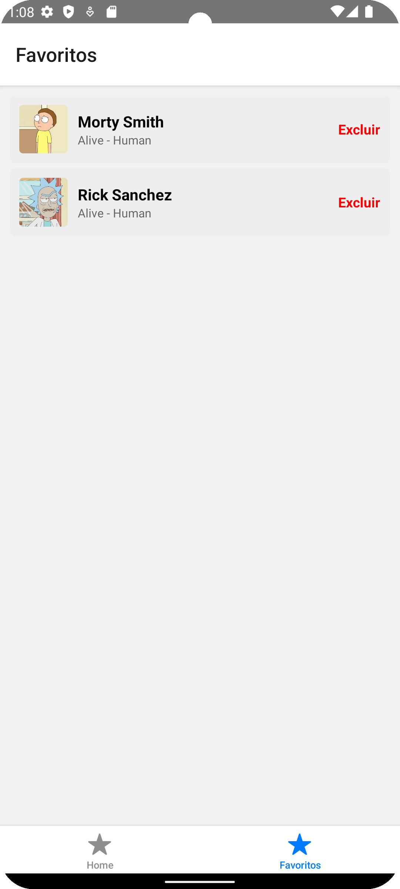
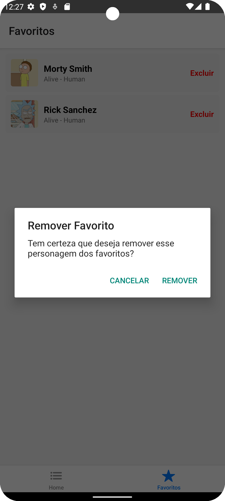

# 🖼 Docs – RMApp

Capturas de tela e evidências do produto final para demonstração do projeto RMApp.

---

## 📸 Prints

### ✅ Lista de personagens

Tela inicial do aplicativo listando personagens da série Rick and Morty.  
Inclui filtro pelo nome no topo da tela.

---

### 🧙 Detalhe do personagem

Ao clicar em um personagem, abre uma tela com detalhes:
- Nome, status, espécie, gênero
- Localização
- Lista de episódios em que participou

---

### 🎬 Detalhe do episódio

Ao selecionar um episódio na tela do personagem, mostra todos os personagens que participaram do episódio.

---

### ⭐ Favoritos

Tela que exibe os personagens salvos como favoritos.
Os favoritos são persistidos localmente via AsyncStorage.

---

### ❌ Exclusão de favorito

Exemplo de remoção de personagem da lista de favoritos (ação realizada com toque ou botão).

---

## 📂 Observação
> Todas as imagens estão na raiz do diretório `/docs` e são referenciadas no README principal do projeto.

---

Feito por Fred Portela 🚀
